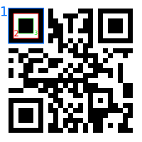
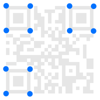
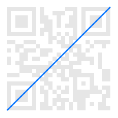
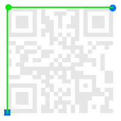
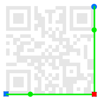

# QR Reader

__QR code reader using OpenCV and pyzbar__

### How it works (general idea)
1. The selected camera is read using OpenCV.
2. For each frame, contours are detected (using `cv2.threshold` with Otsu, and then `cv2.findContours`).
3. From this contours, the program looks for squares (with a certain deformation).
4. With a set of squares, an algorithm is used to deterimine if there is a QR in this set of squares.
5. In affirmative case, an algorithm is used (function `detect_qr`) to, given three contours of the QR, obtain the square that contains the entire QR.
6. If detection completed sucessfully, the corresponding homography is computed (function `qr_search_homography`).
7. With the homography (the homography matrix), the QR in the input image is converted (using `qr_wrap_perspective`) to obtain a completely plain image of the QR.
8. The plain image of the QR is passed to pyzbar (using function `decode`), which will return the string of the QR.

### How it works (detailed)

To obtain the contours, `cv2.findContours` is used. However, the input of this function must be a binary image. Thus, the input frame is binarized using the `cv2.threshold` with the Otsu method. Then, the `cv2.findContours` will return a list of contours. The program needs to filter, among this contours, which of them are squares. They don't have necessary to be perfect squares, though. In this way, we can also detect QR codes that appears with a certain perspective. The algorithm to filter the squares, given a contour is quite simple. A square is a contour that:
- Has 4 vertex.
- The area, in pixels, is greater than 300 (we discard very small 4-side polygons.
- The aspect ratio is between 0.85 and 1.3.

This heuristic give pretty good results filtering squares. If a contour passes this filters, it is added to the `valid_cnts` list. With it, the program uses an algorithm do deterimine if there may be a QR in the image. The algorithm iterates over the list of contours. For each one, it will try to count how many squares are contained inside it. If it contains one or two squares, the algorithm takes the current square as a possible square of the QR. Given a edge of a QR, we could find three diferent squares.

In the image, the square 1 is the one we are talking about right now. So, it can contain one square (the number 2) or two (both the number two and three). It depends if the camera is near enough so that OpenCV can detect the contours of both squares. So, if the current square contains one or two squares inside it, it will add the contour of the square to `edge_candidates`. The algorithm will consider that the current image contains a QR if there is exactly 3 contours in `edge_candidates`, corresponding to the 3 contours of the squares of the QR.

Once the three contours are found, the function `find_qrcnts` will compute the four edges of the QR. This is, the function will take this input:

And will compute the output as:

The order of the contours in the second image is not known, neither the order of the edges inside each one of the contours. Thus, a custom algorithm is applied to deterimine which of the edges correspond to which of the contours in the python list.

The first task is to find the two squares that mades the diagonal. This is, we want to find:

This is done computing all the possible lines (between the 12 possible points, as can bee seen in the Image 2), and finding the longest line. This line is the diagonal, and the two points that make this line are the edges of two of the squares of the QR.

The third square is known, but we still have to figure out which point of the four we have is que edge. This is computed with a similar approach. With four points, we can build four lines to the other squares. Thus, we will compute, for every of the four points, the sum of the length of the line between the current point and the first square and the length between the same point to the second square. The biggest distance (the one shown in the image) give us the third edge:

Lastly, to find the last edge (where no square is drawn in the QR), the following approach is used:

For the two squares shown, the program computes all the possible lines. For each possibility, we try to compute the intersection of them, using cross product (with `np.cross(l1, l2)`). This gives us the point where both lines interject. There may be more than one combination of points that give an interjection (due to the perspective). Thus, among all combinations, the one that gives the biggest area (forming a complete square, this is, using the 4 edges), is the one that is kept as the last edge. The image shows the combination we are interested in, with the lines drawn in green, the edges that were already computed in blue, the edges that gave the good combination in green and, the fourth and final edge, in red.

Once we have the four edges, and using the input image, we have to build an image that is the QR completely plain, so that we can we read the code properly. To do it, the first step is to compute the homography that transform the points in the real world (the input image), to a completely plain image. This is computed in `qr_search_homography`. Inside it, we create the array of 4 points ( `pts`) that represent the QR viewed from above (this is, a completely plain QR). In other words, this is the same as a perfect square. The order of this array is crucial because it must match the order of the points of the QR edges in the input image, which is contained in `qr_outside_cnt`. For example, the first point in `pts` is (0, 1). This means that the first point in `qr_outside_cnt` is the right upper edge.

With `cv2.findHomography` we find the homography matrix. With it, the `qr_wrap_perspective` function transforms the input image of the QR to a plain one. This image is the one shown in the "`qr`" window. Lastly, this image is passed to `pyzbar`, that will try to read the code, using de `decode` function.
